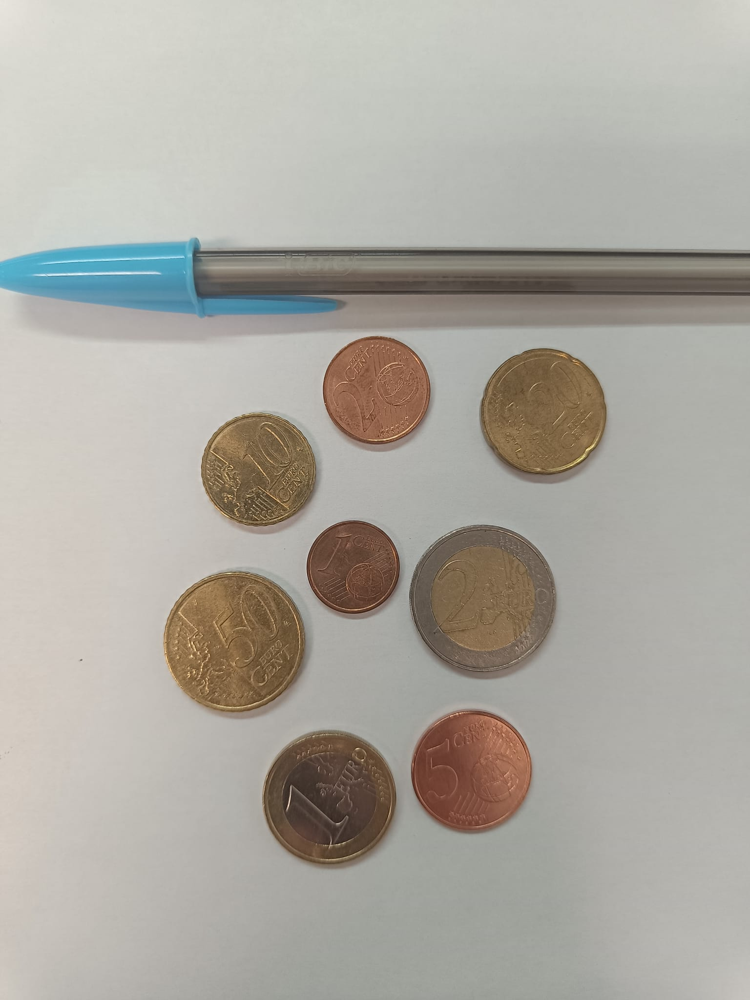
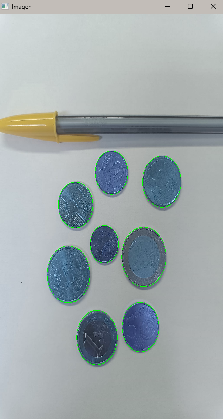
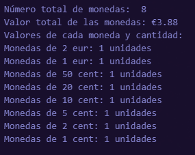
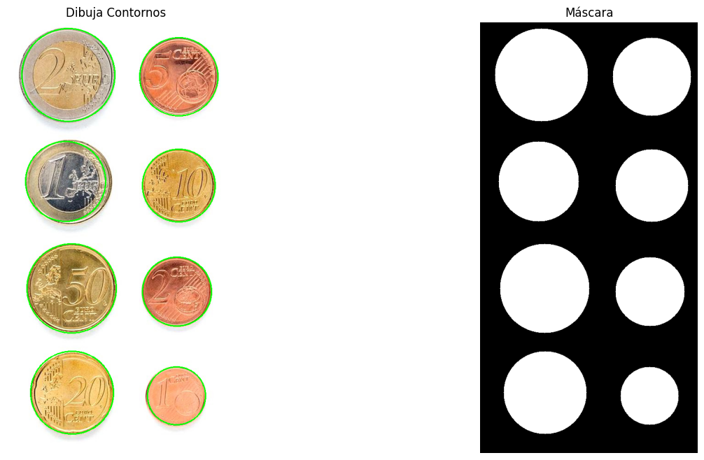
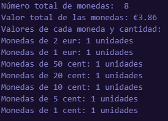
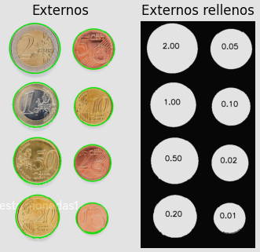
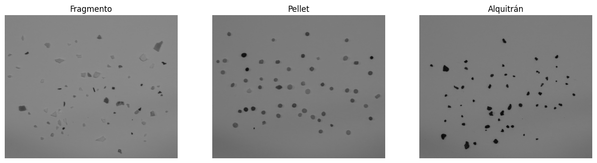
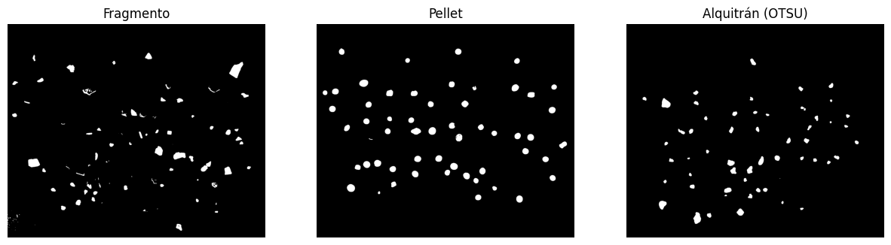
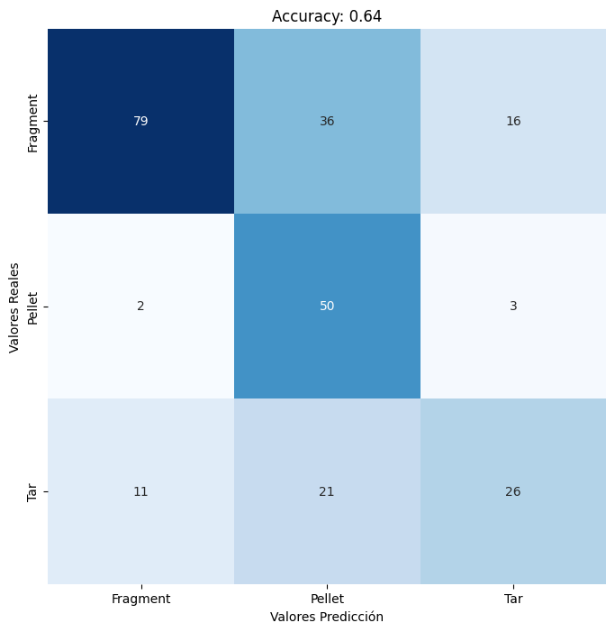
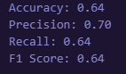

# Práctica 3

En esta práctica se abordan varios aspectos relacionados con el procesamiento de imágenes y la clasificación de objetos, utilizando diversas librerías de Python como OpenCV y NumPy. Además, se emplean herramientas de visualización de datos como Matplotlib y Seaborn.

## Autores

## Tecnologías 

## Librerías

## Objetivos
- Familializarse con OpenCV para el procesamiento de imágenes.
- Aprender a manipular los píxeles de las imágenes correctamente.
- Desarrollar un clasificador de monedas.
- Desarrollar un clasificador de imágenes para microplásticos y evaluarlo.

## Contenidos
1. [Cantidad de monedas](#1-cantidad-de-monedas)
2. [Microplásticos](#2-microplásticos)
3. [Conclusión](#3-conclusión)

### 1. Cantidad de monedas

En esta tarea se carga una imagen de monedas llamada 'monedas.jpg' y se utiliza OpenCV para detectar y dibujar los contornos de las monedas en la imagen. 

Luego, se convierte la imagen a escala de grises y aplica un suavizado. 

Con la función `HoughCircles`, se detectan los círculos que representan las monedas. 

Se desplega una ventana emergente y se puede hacer clic en la imagen para seleccionar una moneda de referencia, lo que permite identificar y clasificar las demás monedas en función del radio de esa moneda seleccionada aunque la referencia principal es la de 1 euro. 

Finalmente, se muestra la imagen procesada, la máscara de dicha imagen y el calculo del valor total de todas las monedas detectadas. Debería sacarse la fotografía paralelo a las monedas para que funcione y ni muy cerca ni muy lejos.

Resultados numéricos:

Se ha intentado clasificar las monedas con el mismo código para la fotografía proporcionada por el profesor y resulta que al no tener la misma escala de fotografía no se detecta correctamente los 2 céntimos.

Resultados numéricos:

Hay que tener en cuenta que el código podría no funcionar con otras imágenes debido a la escala de las mismas. Con lo cual, lo mejor sería probar este clasificador de monedas con una imagen de la misma escala que la primera.

Se ha elaborado otro código para la tarea que detecta mucho mejor las monedas proporcionadas por el profesor, este código define valores de referencia para diámetros y valores monetarios de diferentes monedas, el código permite seleccionar manualmente una moneda aunque la referencia está establecida a 1 euro.

Se carga la imagen, se convierte a escala de grises, y se realiza un umbralizado binario invertido para resaltar las monedas y detectar los contornos.

Se utiliza `cv2.findContours` para identificar los contornos de las monedas en la imagen umbralizada.

Para cada contorno detectado, se calcula el radio del círculo mínimo que lo contiene y se estima el tamaño de cada moneda detectada en función de la referencia seleccionada, comparándolo con los valores de referencia `coin_diameter`. Por otro lado, se determina el valor monetario de cada moneda utilizando `coin_calc` y se suma al valor total de las monedas detectadas.

Por último, se muestra las imágenes con los contornos detectados y la máscara de las monedas resaltadas.

Y se imprime el valor calculado de las monedas detectadas.

Este código tambien tiene el problema de que puede no funcionar correctamente si la imagen de entrada tiene una escala muy diferente a la de la referencia establecida, por lo que se recomienda usar imágenes con escalas similares.

### 2. Microplásticos

En esta tarea, se procesan tres imágenes (fragmentos, pellets y alquitrán) aplicando operaciones de recorte para evitar áreas con sombras, conversión a escala de grises para simplificar el análisis y suavizado de tipo gaussiano para reducir el ruido y suavizar los contornos. 

Fragmentos:

Pellets:

Alquitrán:

Para las imágenes de `fragmento` y `pellet`, se utiliza un umbral fijo para binarizar imágenes y para `alquitrán` y se clasifican los contornos detectados según reglas heurísticas para predecir a qué clase pertenece cada objeto.

Se extraen características de cada contorno, como área, perímetro, compacidad, relación de aspecto y el ajuste a una elipse.

2

El modelo predice entre estos elementos, y la evaluación del clasificador se realiza mediante una matriz de confusión, y se calculan métricas de `accuracy`, `precision`, `recall` y `f1-score`. 

Finalmente se visualizan los resultados:

Resultados numéricos:

Posibles razones de los resultados obtenidos:

`Accuracy`: La precisión general de la clasificación es del 64%, lo que indica que el modelo acierta en la predicción de la clase en aproximadamente 2 de cada 3 casos.

`Precision`: La precisión de 0.70 refleja que, de las predicciones hechas para cada clase, el 70% fueron correctas. Esto sugiere que el modelo es razonablemente bueno para evitar falsos positivos.

`Recall`: El valor de recall es similar al de accuracy, lo que implica que el modelo detecta correctamente las instancias de cada clase en un 64% de los casos. Es decir, un 36% de los objetos no fueron identificados correctamente.

`F1 Score`: Es la media armónica entre la precisión y el recall, y esta se mantiene en 0.64, lo cual es consistente con los valores de las demás métricas, indicando un balance entre la precisión y la capacidad de detección del modelo.

### 3. Conclusión

En esta práctica, mi compañero y yo hemos implementado con éxito los dos clasificadores requeridos para ambas tareas, lo que nos ha permitido profundizar en las aplicaciones de la visión por computador. A lo largo del proceso, hemos adquirido nuevas habilidades en el uso de herramientas avanzadas de procesamiento de imágenes. Además, la visualización de los resultados ha sido clave para entender mejor el comportamiento del clasificador de microplásticos, lo que nos ha proporcionado una visión más clara sobre su precisión y posibles áreas de mejora.
