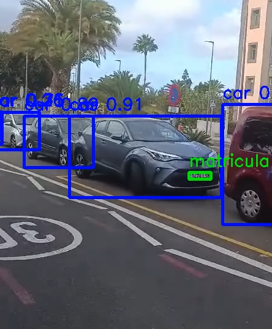

# Práctica 4

Este proyecto explora el uso de modelos avanzados de detección de objetos y reconocimiento óptico de caracteres (OCR) en tiempo real, enfocado en el análisis de video para la identificación de matrículas de coches.

## Autores

## Tecnologías 

## Librerías
  
  
  
  

## Objetivos
- Un detector de objetos, que permita localizar vehículos y personas.
- Un localizador de matrículas.
- Reconocedor de texto.

## Contenidos
1. [Entrenamiento](#1-entrenamiento)
2. [Detector de matrículas](#2-detector-de-matrículas)
3. [Conclusión](#3-conclusión)

### 1. Entrenamiento
Se ha entrenado un conjunto de dataset de cosecha propia se tres formas:

- Una primera forma con 40 épocas y 416 de tamaño de imagen:

- Una segunda forma con 100 épocas y 416 de tamaño de imagen:

- Una tercera forma con 200 épocas y 640 de tamaño de imagen.

Se determinó que el mejor entrenamiento era el de la segunda forma con 100 épocas al comprobar que hacía mejores detecciones.

Para obtener el conjunto del dataset utilizado se puede ir a este enlace: https://alumnosulpgc-my.sharepoint.com/:u:/g/personal/maria_navarro140_alu_ulpgc_es/Ed92mJOFrj1Mq2bi1qI6WPEBUDdZMwWxvT6d7gIdrwUyWA?e=LpFGQe

Por otra parte, para separar los conjuntos de datos de forma aleatoria en `train`, `valid` y `test`, se hizo uso de un script que se ha adjuntado en la práctica llamado `main.py` que depende de algunas funciones de `dir_functions.py`.

#### main.py

Este script distribuye aleatoriamente imágenes de una carpeta de entrenamiento a las carpetas de validación y prueba.

- Determina el número de imágenes en la carpeta de entrenamiento.
- Calcula aproximadamente el 20% para validación y el 10% para prueba.
- Llama a random_file_fetcher para seleccionar y mover archivos de manera aleatoria a cada carpeta de destino.
- Imprime el conteo de archivos movidos y los restantes.

#### dir_functions.py

- `get_dir_names(main_path)`: Obtiene los nombres de las carpetas en un directorio principal.
- `get_dir_file_count(main_path)`: Cuenta el número de archivos en una carpeta específica.
- `get_path(main_path, dir_name)`: Construye una ruta completa dado un directorio principal y un nombre de subcarpeta.
- `random_file_fetcher(source_path`, `dest_path`, `files_to_move`): Toma un número especificado de archivos de la carpeta de origen y los mueve aleatoriamente a una carpeta de destino.

### 2. Detector de matrículas

Se realizan las siguientes funciones:

- Detecta vehículos (coches y motocicletas), personas y matrículas en cada fotograma de un video.
- Anota las detecciones en tiempo real en el video, indicando el tipo de objeto y su confianza.
- Usa OCR para extraer el texto de las matrículas, manteniendo visible la última matrícula detectada durante un tiempo específico.
- Guarda todas las detecciones y la información de las matrículas en un archivo CSV para análisis posterior.

La estructura del código es la siguiente:

- Creación del Archivo CSV: Al inicio, se crea un archivo CSV con encabezados para guardar los detalles de cada detección.
- Procesamiento de Detección General: La función procesar_detecciones_generales identifica personas, coches y motocicletas en el video.
- Procesamiento de Detección de Matrículas: procesar_detecciones_matriculas detecta matrículas dentro de los vehículos detectados.
- OCR para Matrículas: Con EasyOCR, se intenta leer el texto en las matrículas detectadas.
- Mostrar Matrículas en Pantalla: mostrar_matriculas_en_pantalla muestra las matrículas en pantalla por un tiempo configurable.
- Bucle Principal: Procesa el video, escribe las detecciones en el CSV y guarda el video de salida con anotaciones.

Para obtener un vídeo de la detección de matrículas se puede ir a este enlace: https://alumnosulpgc-my.sharepoint.com/:v:/g/personal/maria_navarro140_alu_ulpgc_es/Efq_U0BwbZJDu7Mc2sdkHYYB5QIi6_CEZHFuCl8IGKXfQg?nav=eyJyZWZlcnJhbEluZm8iOnsicmVmZXJyYWxBcHAiOiJPbmVEcml2ZUZvckJ1c2luZXNzIiwicmVmZXJyYWxBcHBQbGF0Zm9ybSI6IldlYiIsInJlZmVycmFsTW9kZSI6InZpZXciLCJyZWZlcnJhbFZpZXciOiJNeUZpbGVzTGlua0NvcHkifX0&e=rzimmW 

#### Descripción del Archivo CSV
Las detecciones se guardan en el archivo detecciones.csv con los siguientes campos:

- `fotograma`: Número del fotograma en el que se detectó el objeto.
- `tipo_objeto`: Tipo de objeto detectado (persona, coche, motocicleta, matrícula).
- `confianza`: Confianza de la detección del modelo.
- `identificador_tracking`: Identificador de clase de YOLO.
- `x1`, `y1`, `x2`, `y2`: Coordenadas de la caja delimitadora.
- `matricula_en_su_caso`: Si el objeto es una matrícula, se marca este campo.
- `confianza_matricula`: Confianza de detección de la matrícula.
- `mx1`, `my1`, `mx2`, `my2`: Coordenadas de la caja de la matrícula dentro del vehículo.
- `texto_matricula`: Texto detectado en la matrícula (si aplica).

### 3. Conclusión

La práctica ha sido muy constructiva pero también costosa en el uso de modelos avanzados de visión por computador, donde tanto mi compañero como yo, hemos colaborado para la detección de las matrículas de los vehículos y OCR de manera efectiva. La implementación y el análisis de diferentes modelos de entrenamiento ha permitido seleccionar el modelo más adecuado, optimizando la precisión en la detección de matrículas.

Este proyecto no solo demuestra la capacidad de integrar detección y reconocimiento de texto en un sistema, sino que también abre oportunidades para aplicaciones en contextos reales. Puede utilizarse, por ejemplo, en sistemas de control de acceso en parkings, supervisión de tráfico en carreteras o incluso en sistemas de vigilancia urbana. La estructura modular y el almacenamiento detallado en un archivo CSV facilitan el uso y análisis de datos para futuras mejoras en la precisión del modelo y su adaptación a distintos escenarios.
