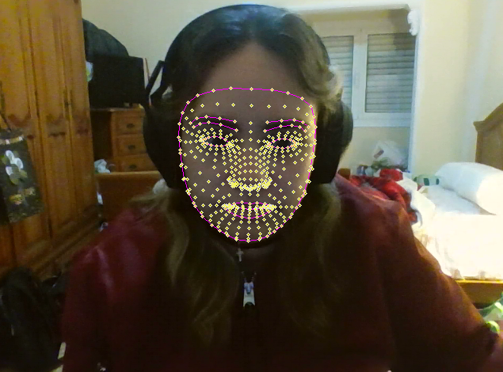
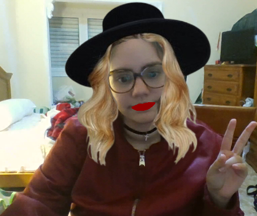
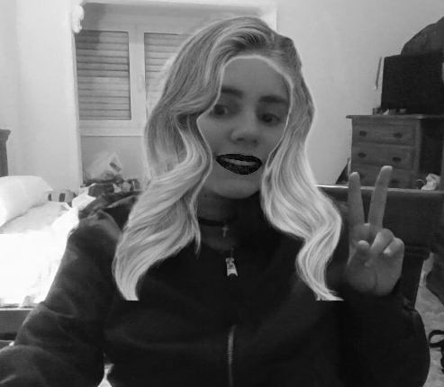

# Práctica 5

Este proyecto, utiliza OpenCV y Mediapipe para crear un filtro que superpone texturas de labios y cabello en tiempo real sobre la imagen capturada desde la cámara. El filtro alterna entre dos estilos cuando se presiona la tecla '1'.

## Autores

## Tecnologías 

## Librerías
  
  
  

## Contenidos
1. [Máscara en Mediapipe](#1-máscara-en-mediapipe)
2. [Filtros](#2-filtros)
3. [Conclusión](#3-conclusión)
4. [Bibliografía](#4-bibliografía)

### 1. Máscara en Mediapipe

Este script captura video en tiempo real desde la cámara web, detecta la malla facial y dibuja los contornos faciales en la imagen. 

### 2. Filtros

El proyecto permite aplicar texturas y superposiciones personalizadas a diferentes zonas del rostro. Al presionar la tecla '1', se activa un filtro que superpone una textura específica en los labios y un estilo de cabello en la cabeza. Con dos opciones de filtro, el usuario puede alternar entre texturas de labios en color negro o rojo, y entre estilos de cabello.

El proceso sigue estos pasos:

- Captura de video en tiempo real: Utiliza OpenCV para capturar el video de la cámara y convertir el formato de color para facilitar el procesamiento.
- Aplicación de texturas en los labios: A partir de los puntos de los labios detectados por Mediapipe, se aplica la textura correspondiente, ya sea negra o roja.
- Superposición de cabello: La textura del cabello se carga y ajusta para adaptarse a la forma del rostro detectado, superponiéndola sobre la imagen en tiempo real.

Filtro por defecto:

Filtro al apretar '1':

### 3. Conclusión

Esta práctica nos ha permitido a mi compañero y a mi, aplicar conceptos de visión por computador y procesamiento de imágenes para crear un filtro visual que altera la apariencia del usuario en tiempo real, utilizando técnicas avanzadas como detección de rostros y puntos faciales.

### 4. Bibliografía
- [Máscara de Mediapipe](https://omes-va.com/malla-facial-mediapipe-python/)
- [Puntos en Mediapipe](https://github.com/k-m-irfan/simplified_mediapipe_face_landmarks)

